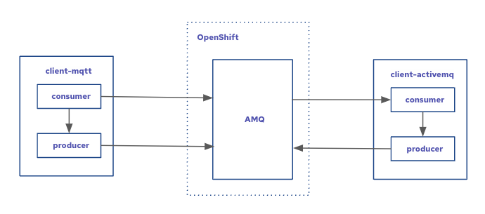

# AMQ Broker / MQTT / Camel-Quarkus(JMS)



This has been tested on OpenShift 4.9

## Install Operators

First, install the AMQ Broker operator.  You can do this through the OpenShift UI as an admin, or by executing the following command using the `oc` cli as a `cluster-admin`.

```
oc apply -k manifests/operators
```

## Generate Certificates

For convenience, you can use the `cert.sh` script to generate certificates and add them to a `Secret`.  It assumes you are logged in ahead of time with the `oc` cli so that it can get the `apps` router url from your cluster.

From a Mac or Linux terminal, run:

```
./cert.sh mypassword
```

Where `mypassword` is any password you would like to use for the keystore.  This will use the Java keytool to generate a keystore and trustore, then encode them in a `secret` that will get added to the `manifests/broker` directory.  This secret is already added to the `.gitignore` file, so it will **not** be pushed to your git repo.

## Broker Instance

Once the operator is installed and you have generated your certificates/secret, you can create a Broker instance and the Topic.

```
oc apply -k manifests/broker
```

## Build and Run MQTT Consumer and Producer Application

Once the broker is up and running, you can build and run the "client-mqtt" application in dev mode.

```
cd client-mqtt
mvn clean quarkus:dev -Dcamel.component.paho.broker-url=$YOUR_AMQ_ROUTE_URL
```

## Build and Run JMS Consumer and Producer Application

Once the broker is up and running, you can build and run the "client-activemq" application in dev mode.

```
cd client-activemq
mvn clean quarkus:dev -Dcamel.component.activemq.broker-url=$YOUR_AMQ_ROUTE_URL
```